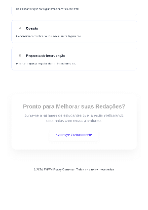

# ENEM Essay Corrector: AI-Powered Writing Assistant

An AI-powered web application that helps Brazilian high school students prepare for the ENEM exam by providing instant, detailed feedback on practice essays. Users can upload handwritten or digital essays, receive an accurate transcription via OCR, and get a comprehensive evaluation based on official ENEM criteria, powered by Google's Gemini Pro.

## Live Demo & Screenshots

**[Live Demo](https://enem.octacity.org)**

### Landing Page




### Sign-in Page


### Dashboard


### Essay Upload


### Evaluation Results


## How It Works

1.  **Upload Your Essay:** Users can drag and drop or select image files (JPG, PNG) or PDFs of their handwritten or typed essays.
2.  **AI-Powered Transcription:** The system uses Google Vision API to perform Optical Character Recognition (OCR) on the uploaded image, converting it into digital text.
3.  **AI-Powered Evaluation:** The transcribed text is sent to Google's Gemini Pro, which analyzes the essay based on the 5 official ENEM competencies and generates a detailed evaluation with scores and feedback.
4.  **View Your Results:** The user receives a comprehensive report with an overall score, a breakdown of each competency, and actionable feedback for improvement.

## Key Features

- **Secure Authentication:** Google OAuth 2.0 for safe and easy user access, with data protected by Supabase's Row Level Security.
- **Drag-and-Drop Upload:** A user-friendly interface that supports images (JPG, PNG) and PDFs, with previews and validation.
- **AI-Powered OCR:** Utilizes Google Vision API to accurately transcribe handwritten or typed text, achieving high accuracy with language hints.
- **AI-Powered Evaluation:** Leverages Google Gemini Pro with a custom prompt to analyze essays based on the 5 official ENEM competencies, providing scores and detailed, constructive feedback.
- **Interactive Dashboard:** Allows users to manage their essays, track their progress with statistics (total essays, average score), and view their evaluation history.
- **Detailed Results Page:** Presents the evaluation in a clear and organized manner, with color-coded scores and collapsible sections for detailed feedback on each competency.
- **Responsive Design:** Fully functional and visually appealing on desktops, tablets, and mobile devices, built with Tailwind CSS.

## System Architecture

The application is built on a modern, serverless architecture that is scalable, secure, and cost-effective.

- **Frontend:** A Next.js 14+ application deployed on Vercel, utilizing the App Router for server-side rendering and API routes.
- **Backend:** Supabase provides the backend-as-a-service, handling the PostgreSQL database, user authentication, and file storage.
- **AI Services:** Google Cloud Vision API and Gemini Pro are integrated via API routes to handle the heavy lifting of OCR and essay evaluation.


## Tech Stack

- **Frontend:** Next.js 14+ (App Router), TypeScript, Tailwind CSS
- **Backend:** Supabase (PostgreSQL, Auth, Storage)
- **AI Services:** Google Vision API (OCR), Gemini 1.5 Pro (Evaluation)
- **Deployment:** Vercel

## Technical Deep Dive

-   **Next.js App Router**: The project leverages the Next.js App Router for a modern, server-centric architecture. This allows for the use of Server Components to fetch data directly on the server, reducing client-side bundle sizes and improving performance. API routes are used to create a secure backend for handling file uploads, OCR processing, and AI evaluation requests.
-   **Supabase Integration**: Supabase is used as a comprehensive backend-as-a-service solution.
    -   **Database**: A PostgreSQL database stores user data, essay metadata, and evaluation results.
    -   **Authentication**: Supabase's built-in authentication is used to manage user sign-up and login via Google OAuth. Row Level Security (RLS) policies are enforced to ensure that users can only access their own data.
    -   **Storage**: Essay files (images and PDFs) are uploaded to a Supabase Storage bucket, providing a secure and scalable solution for file management.
-   **AI Integration**:
    -   **Google Vision API**: The OCR functionality is powered by the Google Vision API, which is called from a Next.js API route. The API's `DOCUMENT_TEXT_DETECTION` feature is used for its high accuracy in extracting text from images.
    -   **Gemini Pro**: The AI evaluation is performed by the Gemini Pro model. A carefully crafted prompt is sent to the model, instructing it to analyze the essay based on the 5 official ENEM competencies and return a JSON object with the evaluation results. This structured data is then parsed and displayed on the frontend.

## Project Status

This project was developed in distinct phases, with the core functionality now complete.

- [x] **Phase 1: Project Setup** - Initial configuration and project structure.
- [x] **Phase 2: Supabase Integration** - Database schema, storage, and RLS policies.
- [x] **Phase 3: Authentication** - Secure user login with Google OAuth.
- [x] **Phase 4: File Upload System** - Essay submission with drag-and-drop.
- [x] **Phase 5: OCR Integration** - Text extraction from images using Google Vision API.
- [x] **Phase 6: AI Evaluation Engine** - Essay analysis and feedback generation with Gemini Pro.
- [x] **Phase 7: UI/UX Polish** - Further improvements to the user interface.
- [ ] **Phase 8: Testing & QA** - Implementation of a comprehensive testing suite.
- [x] **Phase 9: Deployment** - Final preparations for a production environment.

## Features in Detail

-   **Authentication**: User sign-in is handled via Google OAuth, facilitated by Supabase's authentication service. The session is managed through cookies for persistent logins.
-   **File Upload**: A drag-and-drop interface allows users to upload essay images or PDFs. The files are stored in a Supabase Storage bucket, and the file path is saved in the PostgreSQL database.
-   **OCR Processing**: When a file is uploaded, a Next.js API route triggers the Google Vision API to perform OCR. The extracted text is then stored in the database.
-   **AI Evaluation**: The user can request an evaluation from the essay details page. This action calls another API route that sends the transcribed text to the Gemini Pro API. The AI returns a detailed analysis based on the 5 ENEM competencies, which is then parsed and displayed to the user.
-   **Dashboard**: The user dashboard fetches all submitted essays from the database and calculates statistics like the total number of essays and the average score.

## Getting Started

### Prerequisites

-   Node.js >= 18.x
-   pnpm package manager
-   A Supabase account
-   A Google Cloud account (for Vision API and Gemini API)

### Setup Instructions

1.  **Clone and Install Dependencies:**
    ```bash
    git clone https://github.com/your-repo/enem-essay-corrector.git
    cd enem-essay-corrector
    pnpm install
    ```

2.  **Configure Environment Variables:**
    Copy `.env.local.example` to `.env.local` and add your credentials from Supabase and Google Cloud.
    ```bash
    cp .env.local.example .env.local
    ```

3.  **Set Up Supabase and Google Cloud:**
    Follow the detailed instructions in the setup guides:
    -   [Supabase Setup Guide](./docs/setup/SUPABASE_SETUP_GUIDE.md)
    -   [Google OAuth Setup](./docs/setup/GOOGLE_OAUTH_SETUP.md)
    -   [Gemini API Setup](./docs/setup/GEMINI_SETUP.md)
    -   [Database Setup](./docs/setup/DATABASE_SETUP.md)

4.  **Run the Development Server:**
    ```bash
    pnpm dev
    ```

Open [http://localhost:3000](http://localhost:3000) in your browser to view the application.

## License

This project is licensed under the MIT License.
