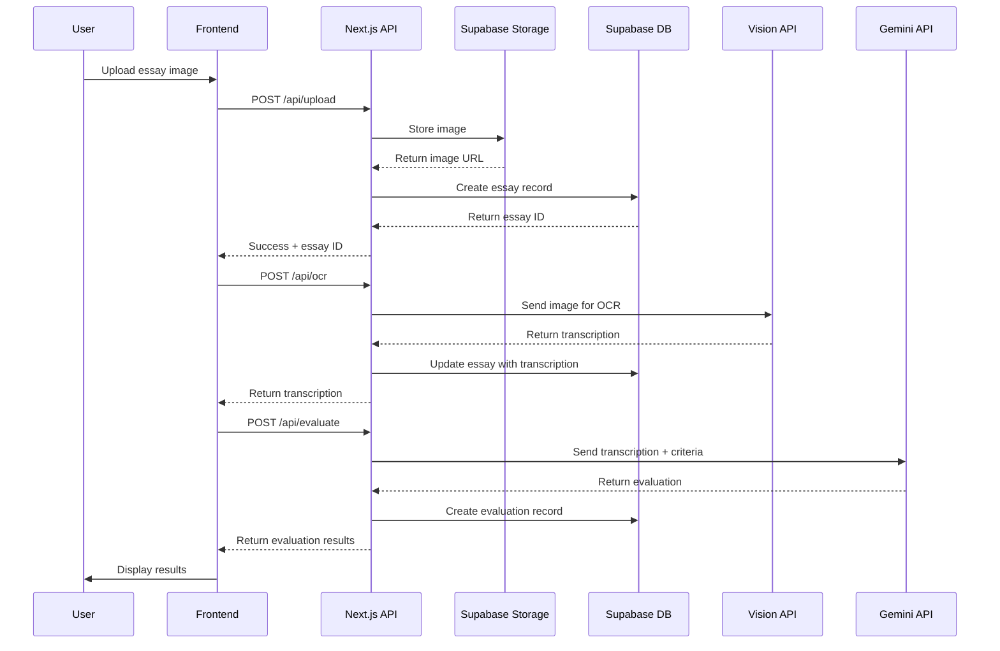

# ENEM Essay Correction App - System Architecture

## Overview
A web application that helps Brazilian high school students prepare for ENEM by providing instant, AI-powered feedback on practice essays using OCR and criteria-based evaluation.

## Target Users
- High school students preparing for ENEM
- 100-500 users (MVP scale)
- Free service

## Tech Stack

### Frontend
- **Framework:** Next.js 14+ (App Router)
- **Language:** TypeScript
- **Styling:** Tailwind CSS
- **Deployment:** Vercel

### Backend
- **BaaS:** Supabase
  - PostgreSQL database
  - Authentication (Google OAuth)
  - Storage (essay images)
  - Row Level Security (RLS)

### AI Services
- **OCR:** Google Vision API (handwriting recognition)
- **LLM:** Gemini 2.5 Pro (essay evaluation)

## System Architecture Diagram

```mermaid
graph TB
    subgraph "Client Layer"
        A[Next.js Frontend]
        A1[Upload Page]
        A2[Dashboard]
        A3[Evaluation Results]
    end

    subgraph "API Layer - Next.js"
        B[/api/upload]
        C[/api/ocr]
        D[/api/evaluate]
        E[/api/essays]
    end

    subgraph "External Services"
        F[Google Vision API]
        G[Gemini 2.5 Pro API]
    end

    subgraph "Supabase"
        H[(PostgreSQL)]
        I[Storage Bucket]
        J[Auth Service]
    end

    A1 --> B
    A2 --> E
    A3 --> E
    
    B --> I
    B --> H
    
    C --> F
    C --> H
    
    D --> G
    D --> H
    
    E --> H
    
    A --> J
    
    style A fill:#61dafb
    style F fill:#4285f4
    style G fill:#8e75b2
    style H fill:#3ecf8e
    style I fill:#3ecf8e
    style J fill:#3ecf8e
```

## Data Flow

### Essay Submission Flow


## Database Schema

### Tables

#### users (Supabase Auth extended)
```sql
-- Extended from auth.users
CREATE TABLE public.user_profiles (
  id UUID REFERENCES auth.users PRIMARY KEY,
  full_name TEXT,
  avatar_url TEXT,
  created_at TIMESTAMPTZ DEFAULT NOW(),
  updated_at TIMESTAMPTZ DEFAULT NOW()
);
```

#### essays
```sql
CREATE TABLE essays (
  id UUID PRIMARY KEY DEFAULT uuid_generate_v4(),
  user_id UUID REFERENCES auth.users NOT NULL,
  title TEXT NOT NULL,
  image_url TEXT NOT NULL,
  transcription TEXT,
  status TEXT CHECK (status IN ('uploaded', 'transcribed', 'evaluated')) DEFAULT 'uploaded',
  created_at TIMESTAMPTZ DEFAULT NOW(),
  updated_at TIMESTAMPTZ DEFAULT NOW()
);

-- RLS Policies
ALTER TABLE essays ENABLE ROW LEVEL SECURITY;

CREATE POLICY "Users can view own essays"
  ON essays FOR SELECT
  USING (auth.uid() = user_id);

CREATE POLICY "Users can insert own essays"
  ON essays FOR INSERT
  WITH CHECK (auth.uid() = user_id);

CREATE POLICY "Users can update own essays"
  ON essays FOR UPDATE
  USING (auth.uid() = user_id);

CREATE POLICY "Users can delete own essays"
  ON essays FOR DELETE
  USING (auth.uid() = user_id);
```

#### evaluations
```sql
CREATE TABLE evaluations (
  id UUID PRIMARY KEY DEFAULT uuid_generate_v4(),
  essay_id UUID REFERENCES essays NOT NULL,
  overall_score INTEGER CHECK (overall_score >= 0 AND overall_score <= 1000),
  competency_1_score INTEGER CHECK (competency_1_score >= 0 AND competency_1_score <= 200),
  competency_2_score INTEGER CHECK (competency_2_score >= 0 AND competency_2_score <= 200),
  competency_3_score INTEGER CHECK (competency_3_score >= 0 AND competency_3_score <= 200),
  competency_4_score INTEGER CHECK (competency_4_score >= 0 AND competency_4_score <= 200),
  competency_5_score INTEGER CHECK (competency_5_score >= 0 AND competency_5_score <= 200),
  competency_1_feedback TEXT,
  competency_2_feedback TEXT,
  competency_3_feedback TEXT,
  competency_4_feedback TEXT,
  competency_5_feedback TEXT,
  general_feedback TEXT,
  created_at TIMESTAMPTZ DEFAULT NOW()
);

-- RLS Policies
ALTER TABLE evaluations ENABLE ROW LEVEL SECURITY;

CREATE POLICY "Users can view evaluations of own essays"
  ON evaluations FOR SELECT
  USING (
    EXISTS (
      SELECT 1 FROM essays
      WHERE essays.id = evaluations.essay_id
      AND essays.user_id = auth.uid()
    )
  );
```

#### evaluation_criteria (Reference data)
```sql
CREATE TABLE evaluation_criteria (
  id SERIAL PRIMARY KEY,
  competency_number INTEGER NOT NULL,
  title TEXT NOT NULL,
  description TEXT NOT NULL,
  max_score INTEGER NOT NULL
);

-- Insert ENEM criteria
INSERT INTO evaluation_criteria (competency_number, title, description, max_score) VALUES
(1, 'Domínio da escrita formal', 'Demonstrar domínio da modalidade escrita formal da língua portuguesa', 200),
(2, 'Compreensão do tema', 'Compreender a proposta de redação e aplicar conceitos das várias áreas de conhecimento', 200),
(3, 'Argumentação', 'Selecionar, relacionar, organizar e interpretar informações, fatos, opiniões e argumentos', 200),
(4, 'Coesão textual', 'Demonstrar conhecimento dos mecanismos linguísticos necessários para a construção da argumentação', 200),
(5, 'Proposta de intervenção', 'Elaborar proposta de intervenção para o problema abordado, respeitando os direitos humanos', 200);
```

## API Endpoints

### Authentication
- Handled by Supabase Auth (Google OAuth)
- Session management via cookies

### Essay Management

#### POST /api/upload
Upload essay image and create database record.

**Request:**
```typescript
{
  title: string;
  image: File; // multipart/form-data
}
```

**Response:**
```typescript
{
  essayId: string;
  imageUrl: string;
}
```

#### POST /api/ocr
Process essay image with Google Vision API.

**Request:**
```typescript
{
  essayId: string;
}
```

**Response:**
```typescript
{
  transcription: string;
  confidence: number;
}
```

#### POST /api/evaluate
Evaluate essay using Gemini 2.5 Pro.

**Request:**
```typescript
{
  essayId: string;
}
```

**Response:**
```typescript
{
  evaluationId: string;
  overallScore: number;
  competencies: Array<{
    number: number;
    score: number;
    feedback: string;
  }>;
  generalFeedback: string;
}
```

#### GET /api/essays
List user's essays.

**Response:**
```typescript
{
  essays: Array<{
    id: string;
    title: string;
    status: 'uploaded' | 'transcribed' | 'evaluated';
    createdAt: string;
    evaluation?: {
      overallScore: number;
    };
  }>;
}
```

#### GET /api/essays/[id]
Get essay details with evaluation.

**Response:**
```typescript
{
  id: string;
  title: string;
  imageUrl: string;
  transcription: string;
  status: string;
  evaluation: {
    overallScore: number;
    competencies: Array<{
      number: number;
      title: string;
      score: number;
      feedback: string;
    }>;
    generalFeedback: string;
  };
}
```

## AI Prompt Engineering

### Gemini 2.5 Pro Evaluation Prompt

```typescript
const EVALUATION_PROMPT = `
Você é um avaliador especializado em redações do ENEM. Avalie a seguinte redação de acordo com as 5 competências do ENEM:

COMPETÊNCIA 1 (0-200 pontos): Domínio da escrita formal da língua portuguesa
- Avalie ortografia, gramática, pontuação, concordância, regência

COMPETÊNCIA 2 (0-200 pontos): Compreensão do tema e aplicação de conceitos
- Avalie se o candidato compreendeu o tema e desenvolveu argumentos relevantes

COMPETÊNCIA 3 (0-200 pontos): Seleção e organização de informações
- Avalie a qualidade dos argumentos e exemplos utilizados

COMPETÊNCIA 4 (0-200 pontos): Coesão textual
- Avalie o uso de conectivos e a progressão textual

COMPETÊNCIA 5 (0-200 pontos): Proposta de intervenção
- Avalie se há proposta de solução detalhada e viável

TEMA: {tema}

REDAÇÃO:
{transcription}

Forneça sua avaliação no seguinte formato JSON:
{
  "competency_1": {
    "score": number,
    "feedback": "string"
  },
  "competency_2": {
    "score": number,
    "feedback": "string"
  },
  "competency_3": {
    "score": number,
    "feedback": "string"
  },
  "competency_4": {
    "score": number,
    "feedback": "string"
  },
  "competency_5": {
    "score": number,
    "feedback": "string"
  },
  "general_feedback": "string"
}
`;
```

## Security Considerations

### Authentication
- Google OAuth via Supabase Auth
- JWT tokens stored in HTTP-only cookies
- Session expiry: 7 days

### Authorization
- Row Level Security (RLS) on all tables
- Users can only access their own essays and evaluations
- API routes verify user authentication via Supabase client

### Data Privacy
- Essay images stored in private Supabase bucket
- Signed URLs with expiration for image access
- No sharing of essays between users

### Rate Limiting
- Implement rate limiting on API routes (e.g., 10 evaluations per hour per user)
- Prevent abuse of expensive AI API calls

## Cost Estimation (MVP - 500 users)

### Assumptions
- Average 10 essays per user per month
- 5,000 essays/month total

### Google Vision API
- $1.50 per 1,000 images (first 1,000 free)
- Cost: ~$7.50/month

### Gemini 2.5 Pro API
- Pricing varies (check current rates)
- Estimated: $20-50/month for 5,000 evaluations

### Supabase
- Free tier: 500MB database, 1GB storage, 2GB bandwidth
- Should cover MVP needs: $0/month

### Vercel
- Free tier for hobby projects
- Cost: $0/month

**Total Estimated Cost: $30-60/month**

## Performance Targets

- **Image Upload:** < 2 seconds
- **OCR Processing:** < 5 seconds
- **AI Evaluation:** < 10 seconds
- **Total Time (upload to results):** < 20 seconds

## Scalability Considerations

### Current Architecture (MVP)
- Serverless functions (Vercel)
- Supabase free tier
- Direct API calls to Google/Gemini

### Future Scaling (1,000+ users)
- Implement job queue for OCR/evaluation (e.g., BullMQ + Redis)
- Cache evaluation criteria and prompts
- Consider batch processing for cost optimization
- Upgrade Supabase to Pro tier
- Implement CDN for essay images

## Monitoring & Analytics

### Key Metrics
- User signups per day
- Essays submitted per day
- Average evaluation time
- OCR accuracy (manual review sample)
- User satisfaction (feedback form)

### Error Tracking
- Sentry for frontend/backend errors
- Log API failures (Vision, Gemini)
- Monitor rate limit hits

## Development Phases

### Phase 1: Foundation (Week 1)
- Project setup
- Authentication
- Database schema

### Phase 2: Core Features (Week 2-3)
- File upload
- OCR integration
- AI evaluation

### Phase 3: UI/UX (Week 4)
- Dashboard
- Results display
- User experience polish

### Phase 4: Testing & Launch (Week 5)
- Quality assurance
- Performance testing
- MVP launch

## Next Steps

1. Review and approve this architecture
2. Set up development environment
3. Begin Phase 1 implementation
4. Switch to Code mode for implementation

---

**Document Version:** 1.0  
**Last Updated:** 2025-10-26  
**Status:** Ready for Implementation